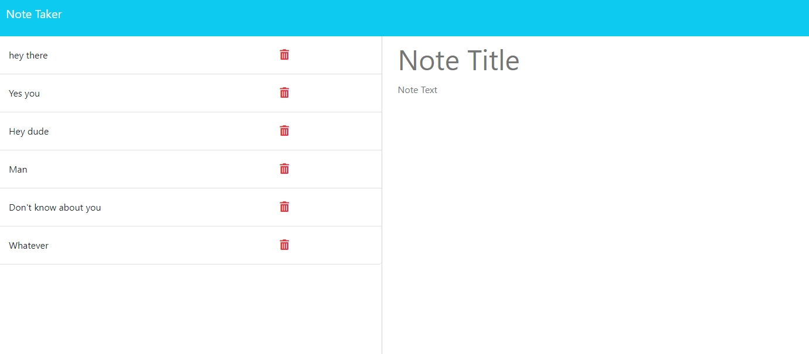

# Note-Taking-App
An app that lets the user writes and stores notes in a database, built with Javascript, Node, Express, and hosted by Heroku.

The fully deployed app can be found [here](https://afternoon-reaches-14924.herokuapp.com/).

## Screenshot

## Features

- Built with Node and Express
- User can input a name and a description for each of the notes they'd like to store, via a save button
- Note data are saved in a database and stayed persistence, until the user decides to delete them via a delete button

## Table of Contents 

* [Installation](#installation)

* [Usage](#usage)

* [License](#license)

* [Contributing](#contributing)

* [Tests](#tests)

* [Questions](#questions)

## Installation

To install necessary dependencies, run the following command:
~~~
npm i
~~~
## Usage

Perform a git clone and run the code with "npm start"

## License

MIT

## Contributing

Fork the repo and create pull requests

## Tests

To run tests, run the following command:
~~~
npm test
~~~
## Questions

If you have any questions about the repo, open an issue or contact me directly at Algarvian2001@yahoo.com. You can find more of my works at [NganPham89](https://github.com/NganPham89).

